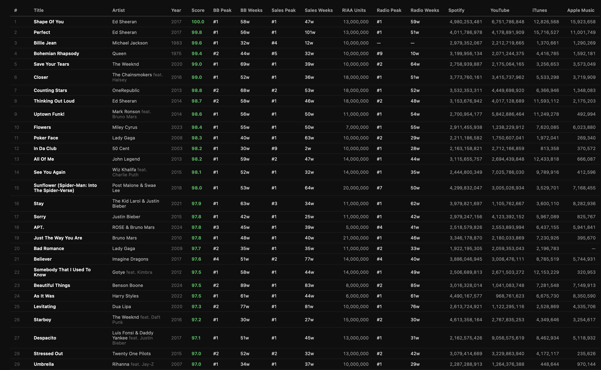
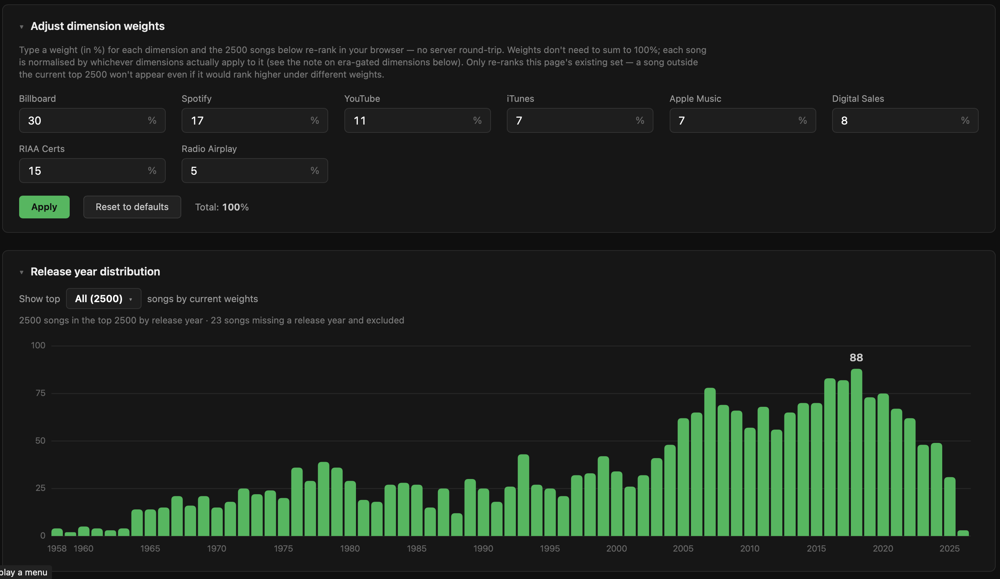

<h1 align="center">Music Popularity Index</h1>

A data pipeline that ranks songs by an era-normalized popularity score, combining
**Billboard chart history** (Hot 100, Digital Song Sales, Radio Songs), **Spotify**
and **YouTube** all-time counts, **iTunes**/**Apple Music** chart points, and **RIAA**
Gold/Platinum/Diamond single certifications into one composite score. Built as the
source of truth for a Name-That-Tune-style music quiz game.

**Live:** [joavn.dev/MPI](https://joavn.dev/MPI)

> **Work in progress.** The scoring model is still being tuned. Rankings,
> weights, and the song pool will change. Don't treat the current numbers as final.

## Screenshots

<p align="center">
    
    <br>
    <em>List sorted by popularity score</em>
</p>

<p align="center">
    
    <br>
    <em>Customizable weights and year distribution graph</em>
</p>

## What it does

- Scrapes the Billboard Hot 100 (1958–present), kworb.net all-time Spotify/YouTube
  counts, kworb.net iTunes/Apple Music chart points, and RIAA single certifications.
  Billboard's Digital Song Sales and Radio Songs charts are also sourced but don't
  have fetcher scripts yet (see `CLAUDE.md`).
- Era-normalizes every dimension so songs from different decades are comparable —
  most via percentile rank within the song's release decade, Billboard/sales/radio
  via a centred rolling-window percentile.
- Produces a ranked list (`output/music_index_full.csv`) and browsable pages
  (`output/index.html`, `output/billboard.html`).

### Scoring (summary)

Eight weighted dimensions, each era-normalized so songs from different decades are
comparable. Exact weights live in `config.py`:

| Dimension | Weight | Era-normalized by | Applies to songs from |
|---|---|---|---|
| Billboard | 30% | ±5-year rolling window | all eras |
| Spotify | 17% | release decade | all eras |
| RIAA certifications | 15% | release decade | all eras |
| YouTube | 11% | release decade | all eras |
| Digital Sales | 8% | ±5-year rolling window | 2004+ |
| iTunes | 7% | release decade | 2010+ |
| Apple Music | 7% | release decade | 2017+ |
| Radio Airplay | 5% | ±5-year rolling window | 1990+ |

- **Billboard / Digital Sales / Radio Airplay**: `0.6 × peak_pct + 0.4 × weeks_pct`
  on the respective chart.
- **Spotify / YouTube / iTunes / Apple Music**: percentile rank of the raw count.
- **RIAA certifications**: percentile rank of certified units (Gold/Platinum/Diamond,
  with `Nx` multipliers) — the one *all-era* dimension besides Billboard/Spotify/
  YouTube, since RIAA has certified singles since 1958 and this is meant to give
  pre-streaming songs a second signal to lean on.
- Dimensions marked with a start year in the table above are era-gated
  (`config.py`'s `_PLATFORM_START` in `score.py`): songs released before that
  platform existed are excluded from the denominator rather than penalized for an
  absence beyond their control.
- Composite is normalized to 0–100.
- `output/index.html` has an in-browser weight adjuster — type a weight (%) per
  dimension and the table re-ranks live in your browser, no server round-trip.

See `CLAUDE.md` for the full architecture and data-flow notes.

## Setup

```bash
python -m venv venv
source venv/bin/activate
pip install -r requirements.txt
```

Create a `.env` with Spotify API credentials:

```
SPOTIFY_CLIENT_ID=...
SPOTIFY_CLIENT_SECRET=...
```

## Running the pipeline

Scrape source data first (slow, resumable — only needed when refreshing data):

```bash
python src/fetch_billboard.py     # Billboard Hot 100 (~875 requests)
python src/fetch_kworb.py         # Spotify all-time streams
python src/fetch_youtube.py       # kworb.net all-time YouTube views
python src/fetch_itunes.py        # kworb.net worldwide iTunes chart points
python src/fetch_apple_music.py   # kworb.net Apple Music chart points
python src/fetch_riaa.py          # RIAA Gold/Platinum/Diamond single certifications (can take hours)
```

Then build everything with the one-command runner:

```bash
python src/run_pipeline.py           # score -> spotify links -> csv -> html
python src/run_pipeline.py --quick   # fast iteration: score -> csv only (no network, no html)
```

Album art is a separate, manual step (like the scrapers above, not part of the
runner — it's a slow external fetch, not a local merge):

```bash
python src/fetch_album_art.py     # album art via Spotify's public oEmbed endpoint (no API keys, resumable)
```

Run it once after `fetch_spotify_links.py` has resolved this run's tracks, then
re-run `export_csv.py` (or the full runner) to merge the art into the output CSV.
Re-running `fetch_album_art.py` later only fetches songs newly added to the pool.

Outputs land in `output/` (`index.html`, `billboard.html`, `music_index_full.csv`).
Tune the song pool size with `TOP_N` in `config.py`.

## Deployment

The site is served from the [Portfolio](https://github.com/JoachimVN/Portfolio)
repo (Vercel, `joavn.dev`) under the `mpi/` path. The built HTML pages
(`output/index.html`, `output/billboard.html`) are committed to this repo and synced
across automatically.

**Automatic:** the `Sync to Portfolio` GitHub Action runs on every push to `main`
that changes a published page. It copies the pages into `Portfolio/mpi/` and pushes.
Requires a repo secret **`PORTFOLIO_TOKEN`** — a personal access token with write
access to `JoachimVN/Portfolio` (the same token CHORIDOR-web uses).

To publish a new build:

```bash
python src/run_pipeline.py      # rebuild the pages
git add output/index.html output/billboard.html
git commit -m "Rebuild index"
git push                        # the Action syncs to joavn.dev/mpi
```

**Manual** (if you'd rather sync from your machine, with `../Portfolio` checked out):

```bash
./sync-portfolio.sh
```
